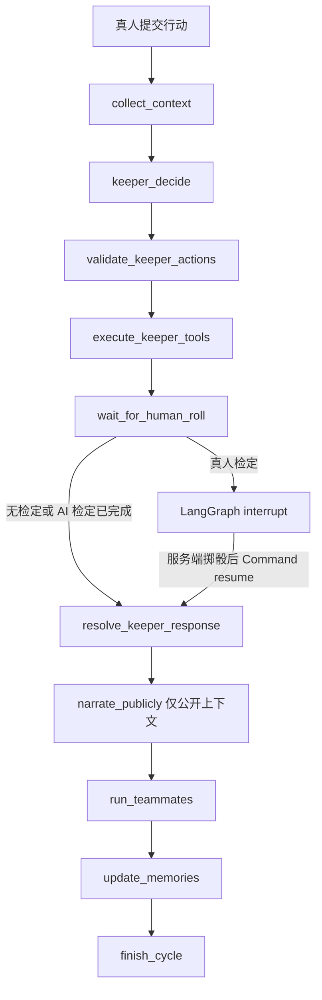

# 第三批 Agent 运行机制

本地单主机、单 Uvicorn worker 原型。真人的一次 `POST /actions` 创建一次回合；Agent 消息只追加事件，不会再启动回合。模型按后端预设串行运行，不能访问数据库会话、仓库、文件或认证信息。

## 数据与图的边界

房间 SQLite 的模组状态、角色快照、检定、事件、记忆是权威数据。LangGraph 使用 `AsyncSqliteSaver`；thread_id 等于 cycle UUID。checkpoint 只包含 `AgentCycleState` 的控制字段：触发事件、当前节点、run/check 引用、工具回执 ID、队友队列、完成队友、调用计数、状态和安全错误。不在图中保存第二份角色、模组或骰点。

`CHECKPOINT_DB_PATH` 显式配置时使用该路径；未配置时，在 `DATABASE_URL` 同目录创建 `<数据库名>.checkpoints.db`，避免测试或自定义数据库误用用户 checkpoint。应用只用 `create_all` 增量新增表，没有修改既有八张表的列。

新增表：`agent_profiles`、`module_snapshots`、`room_agent_bindings`、`agent_cycles`、`pending_checks`、`agent_runs`、`agent_memories`、`agent_tool_receipts`、`agent_save_states`。Pydantic 档案／检定完整字段保存为 JSON document；关联、状态及查询字段独立存列。checkpointer 自行创建其 SQLite 表。

## 回合与中断

状态：`running`、`waiting_for_roll`、`completed`、`failed`、`cancelled`。非终结占用状态 `running/waiting_for_roll/failed` 通过部分唯一索引限制为每房间一条；失败必须重试或取消后才能提交下一次行动。

每个节点重新读取权威 cycle。模型请求在事务和房间锁之外等待；准备调用、落盘输出、执行工具、记录状态各自使用既有 `BEGIN IMMEDIATE` 和房间锁，提交之后调用原 RoomHub 广播。持续存在的 run 输出和工具回执使 checkpoint 节点重放不会重复模型成功调用或工具效果。

真人点击检定卡片时只发送空对象。服务端检查房间、目标身份、原角色绑定及 pending 状态，重新读取不可变角色快照的数值，通过同一个 `DiceService` 和 `rules/checks.py` 掷骰、判定、追加 `check.resolved`。提交完成后才用同一 thread 的 `Command(resume={check_id})` 唤醒；模型不能提供恢复结果。若点击发生在 interrupt 正写入时，完成回调会补做唤醒。重复 roll 返回原已解决记录，不再掷骰、产生事件或发起后续模型调用。

AI 角色的检定在等待节点调用相同服务自动解决。每轮只允许 KP 首次决策申请一次检定；续写节点不能再次申请。普通成功等级与是否达到请求难度分别返回。具体规则及本地译本的大失败阈值见 [SOURCES](../backend/app/rules/definitions/SOURCES.md)。

LangGraph 行为核对来源：[interrupt 与恢复](https://docs.langchain.com/oss/python/langgraph/interrupts)、[持久化](https://docs.langchain.com/oss/python/langgraph/persistence)，以及仓库当前安装包的 `langgraph/checkpoint/sqlite/aio.py`。这里只使用本地 Python graph，不接入托管服务。

## 模组与档案

`agents/definitions/stopped_clock.yaml` 是原创练习：钟楼广场、维修间、齿轮平台三个场景；管理员和修表学徒两名 NPC；路线、传动销、交接簿与一条 keeper_only 信息。传动销需要关联的真实侦查检定成功；进入齿轮平台且公开传动销和交接簿后，确定性结束条件成立。

模组经过 Pydantic 校验及规范 JSON SHA-256 计算，绑定时复制到 `module_snapshots`。房间以后只读该快照。不能中途替换模组；需要另一模组时新建房间。

KP Profile 绑定现有主机管理成员作为 KP 身份，不占调查员角色；调查员 Profile 只绑定有角色快照的 agent 玩家成员。每个席位及每个 Profile 在同房间最多一个启用绑定，避免两位调查员共用私有记忆。修改档案前需解除所有启用绑定。模型生成草稿不会落库，必须在页面编辑并确认保存后才能绑定。模型预设 `default` 使用后端配置，不接受档案内 API Key。

## 工具权限

| 工具 | 角色 | 约束 |
| --- | --- | --- |
| inspect_public_state | KP、调查员 | 当前公开场景、公开 NPC、已揭示线索 |
| inspect_character | KP | 只能查询当前房间角色 |
| request_skill_check | KP | 每轮一次；卡上真实技能／属性；不接收骰点或目标值 |
| reveal_clue | KP | 存在、当前场景、前置线索、关联检定成功；keeper_only 永不公开 |
| update_scene | KP | 必须是快照中已有场景 |
| send_narration | KP | 申请公开叙事；不发布或转交私密决策模型提供的文本 |
| write_memory | KP | 来源权限校验；observation 内容由权威事件重建 |
| inspect_own_character | 调查员 | 只能查询本席位 |
| speak、propose_action | 调查员 | 合计每轮一次，不触发新 cycle |
| write_private_memory | 调查员 | 只能写本人 agent_private belief |

所有工具集中注册 Pydantic 参数及角色名单；拒绝未知字段。每次执行核对 run、房间、当前回合、绑定及活动成员。幂等键为 `run_id:index`，回执同时记录参数哈希；相同键不同参数拒绝。工具失败返回结构化结果，savepoint 回滚该工具，其他已提交效果保留。工具结果进入主机审计，不作为全体玩家事件广播。

执行 KP 初始计划前模拟场景切换顺序，检查关联线索是否处于目标场景、是否确实需要检定。前置条件错误时不执行原计划，记录 rejected run 及结构化错误；允许一次 `keeper_decide_repair` 返回完整替代计划。修正再次失败则结束为 failed，不自动修改场景或替模型掷骰。

模型无 HP、MP、SAN、Luck 更新工具，无骰点注入、SQL、文件或网络工具。普通游戏日志不导出 AgentRun 的上下文或结构化决策。

## 三层记忆与上下文

1. 根据角色在 SQL 查询中过滤事件可见性，再选最近 25 条（可配置 20–30）。排除管理／运行状态事件，保留真人行动、KP 叙事、队友发言和权威结果。
2. 每个 Profile 单独维护滚动摘要，记录覆盖序号；每轮最多一次摘要模型请求，按已有覆盖范围优先照顾未摘要的 Agent。摘要替代旧摘要时仅将旧记录标记 inactive。失败保留旧摘要、写安全审计并继续主回合；摘要不做第二次格式修复调用。
3. `AgentMemory` 支持 observation/belief/goal/relationship/summary，public/agent_private/keeper_only。来源事件须存在且可见；公开记忆仅接受来自公开权威事件的 observation。调查员推断只能是私有 belief。模型不能通过引用合法事件把编造内容提升为 observation：事实正文直接从允许的权威事件生成。正式揭示线索自动生成 public observation。

上下文优先保留模组／当前场景、该身份可读的角色卡、触发行动及本回合检定，再选择目标、摘要、高 salience 记忆和最近事件。按关键词、重要性、时间排序，使用固定字符预算；单个必需上下文超预算明确失败。上下文预算不是精确 tokenizer；实际本地调用还受 Ollama `num_ctx` 和输出长度限制。大量角色或很长资料需调整预算或缩小房间，不能默默丢掉角色卡。

主机 run 调试返回实际注入的事件、记忆、序号范围、模型、耗时、输出及工具回执。玩家无权调用这些接口。调查员上下文使用公开模组投影，未公开场景、keeper brief、隐藏线索与他人私有记忆不会注入。

## 模型限制与安全边界

统一 `AgentModelClient` 实现文本、Pydantic 结构、工具响应解析、超时和取消；每个事件循环共享一个并发数为 1 的信号量。默认每轮最多 6 次实际模型请求（含格式修复和摘要）；每 run 最多 4 个工具；队友依绑定的稳定顺序执行。重试不重置预算。

Ollama Agent 适配器实现既有模型协议，通过原生 `/api/chat` 设置 `num_ctx`、`num_predict`、temperature、keep_alive、think=false；已有兼容适配器保留。图不依赖 Ollama 接口。依据：[Ollama Chat API](https://docs.ollama.com/api/chat)、[上下文与模型驻留设置](https://docs.ollama.com/faq)。自动化测试显式注入 FakeModelAdapter，默认不会访问 Ollama。

本机 llama.cpp 无法编译含较大 maxLength 的字符串语法。因此只对发送给 Ollama 的生成 schema 移除 maxLength；收到结果后仍执行完整 Pydantic 校验，2000 字等限制不会放宽。格式错误最多重发一次，语法编译失败与 OOM 使用不同的安全错误。

模型仅收到经过选择与脱敏的领域数据。主机密钥／模型密钥按值清除，成员 token 和邀请码按已存 SHA-256 识别，不将认证行传给模型。拒绝 hidden-thinking 字段和 think 标签；原生适配器不复制 thinking。错误不保存 provider 原始响应或 Python 异常全文。

`narrate_publicly` 使用同一模型的独立无历史调用，只接收公开模组投影、公开事件、公开 observation、公开检定与角色摘要；不接收 KP 档案背景、keeper brief、隐藏线索、私密记忆或 KP 决策原文。`send_narration` 的文本参数仅供主机审计，不直接发布，也不转交公开叙事模型。检定原因由服务端固定生成，防止私密模型通过 reason 字段传出自由文本。KP 的公开记忆也只能由已授权的权威事件生成。

公开文本还会拒绝未公开模组的原文片段。独立公开上下文解决了私密资料流入叙事模型的问题；它不保证语言模型不会出现普通的虚构或错误解释，真实骰点、正式线索和场景仍以权威事件／卡片为准。增加的叙事调用也计入每轮 6 次预算；一名队友时通常无检定需 3 次、有检定需 4 次，计划修正再用 1 次，格式修复及摘要共享剩余预算。队友较多时可能耗尽预算，需要减少队友或明确调整配置。

## 失败、取消与存读档

模型输出无效时最多修复一次，最终失败写 `agent.run_failed`，回合进入 failed。工具拒绝保留结构化失败回执，未影响的工具及回合可以继续。所有已经提交的事件、真实骰点都不回滚。

主机可取消回合；pending 检定变 cancelled，模型 task 接收取消。只有失败回合且还有调用预算时可重试。暂停、修改绑定／资源等操作在模型实际执行时拒绝；等待检定时允许暂停和保存，解除或更改角色绑定前需取消回合。

`agent_save_states` 与既有房间存档同事务保存模组快照、状态、启用绑定、档案配置、last consumed seq、活动 cycle 引用与控制字段、所有检定、活动结构化记忆及摘要。它不保存认证或连接状态，也不增加原存档表列。若解除绑定后修改了存档引用的档案，读档会明确拒绝，恢复原配置后可再载入；不会改写被其他房间共用的档案。

后端重启不会恢复 HTTP 请求。正在调用模型的 cycle 标为 failed，由主机重试／取消；已写入的真人 interrupt 保持待掷。读档恢复模组、绑定和记忆的活动集合，旧记录不物理删除。仍 pending 的同一中断可继续；已 resolved/cancelled 的检定不回退。若被保存的 cycle 此后已完成，不重新运行它；保持历史并等待新行动。其他未完成状态明确提示主机重试或取消。已失活成员不会复活。历史事件及 revision 永不删除／倒退。

## API 与事件

Profile：GET/POST `/api/agent-profiles`，GET/PATCH `/{id}`，POST `/generate-draft`；GET `/api/agent-model-presets`、`/api/modules`（仅主机）。

房间前缀 `/api/rooms/{room_id}`：GET/PATCH `/agent-config`；POST `/module`、`/agent-bindings`；DELETE `/agent-bindings/{id}`；POST `/actions`；GET `/agent-cycle`；POST `/agent-cycle/cancel`、`/retry`；GET `/checks`；POST `/checks/{id}/roll`（严格空对象）、`/cancel`；GET `/agent-runs`、`/agent-runs/{id}`、`/memories`（仅主机）。

过滤后的普通房间快照新增 `game` 投影，包括模组、公开线索、绑定状态、cycle 状态和可读检定。所有变化继续通过原 `room.event`、`room.snapshot`、`room.synced` 广播，不建立新的 WebSocket 协议。

事件包括 `module.bound/completed`、`action.submitted`、`check.requested/resolved/cancelled`、`keeper.narration`、`clue.revealed`、`scene.updated`、`agent.bound/unbound/configured/cycle_changed/spoke/action_proposed`。`agent.run_failed`、`agent.memory_written` 仅主机。检定事件按目标玩家的 public/actor_and_host/host_only 过滤，隐藏线索关联 ID 不出现在玩家检定投影或公共事件内。

## 第四批接入点

规则书／模组 RAG 应接在 `memory.service.build_context` 的已授权资料检索阶段，返回带来源与可见性的数据，再进入相同预算与脱敏流程。检索器不能替代确定性检定或修改模块快照。先支持小范围关键词／章节检索并测试来源隔离，必要时再考虑 embedding；不要把整本规则书或 KP 内容直接拼入调查员上下文。

## 第五批准入与审阅

准备模组使用已批准实体的房间快照；草稿和拒绝项不进入游戏上下文。KP 可检索原始证据，但新 `module_fact` 必须先经过主机审阅，不能直接写 canonical memory。公开叙事和调查员只获得与真人相同的公开实体。完整模型、工具和权限说明见[模组准备文档](module-preparation.md)。

图新增 `wait_for_host_review`、`execute_deferred_tools`、`wait_for_late_host_review`。初始决策同时请求审阅和检定时，先持久化并 interrupt 审阅，批准后才执行延后的检定工具。检定后的新事实也经过审阅门，但同 cycle 总计最多一次。`wait_reason` 严格区分 `host_review` 和 `human_roll`；活动回合唯一约束包含 `waiting_for_review`。

主机结果先落库，再使用相同 checkpoint 和 cycle ID 恢复；重复提交和工具执行幂等。拒绝分支只尝试一次安全公开改写，失败即返回待裁定并结束，不再执行新提议或队友动作。审阅等待可暂停、保存和重启，不占用模型信号量；取消会取消 pending 审阅。

准备生成独立于游戏 cycle，但与游戏共用串行模型网关。上下文对准备模组省略空条件、重复来源元数据和检定存储字段，保留实际检定值、结果与实体 ID；超预算仍明确拒绝。房间专属批准 proposal 不回写全局准备版本。读档不撤销已公开／修正事实，当前场景与兼容投影一致恢复。
