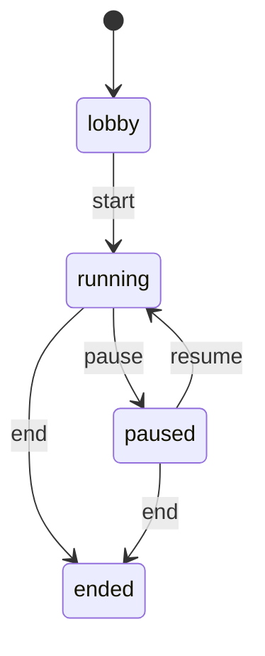

# 多人房间协议 v1

本版为可信局域网内的个人主机应用，使用一个 FastAPI/Uvicorn worker、SQLite 和同源 Vite 代理。没有账号系统、自动 Agent 推理或公网安全设施。

## 状态与成员



`ended` 永久只读，包括成员、存档、邀请码和 last_seen。浏览器仍能连接、阅读和导出；离开结束房间只清除浏览器凭据。其他状态的离开和踢出均失活成员，不删除历史记录。加入、添加玩家、分配及 ready 只允许在 lobby/paused；发布和撤下角色只允许 lobby。聊天和掷骰允许所有未结束状态。

每个房间创建一个 `role=host, controller_type=human, access_type=host_managed` 管理身份；它不绑定角色，不参与开始条件。主机若扮演调查员，额外创建本地真人玩家。玩家身份统一为 `role=player`：

| 席位 | controller_type | access_type | 操作来源 |
| --- | --- | --- | --- |
| 本地真人 | human | host_managed | 主机代表操作，有明确 actor 与 operator |
| 远程真人 | human | remote | 独立房间重连凭据 |
| Agent 占位 | agent | host_managed | 主机分配角色和 ready；尚未接入自动行动 |

活动显示名去首尾空白、按 Unicode casefold 去重；数据库部分唯一索引兜底。最多 100 个活动成员、100 个角色席位。一个玩家至多一个角色，一个席位至多一个玩家。分配变化会取消对应 ready。开始及恢复都要求至少一个活动玩家，所有活动玩家已分配角色且 ready。主机仅能代 host_managed 玩家设置 ready，远程玩家自己设置。

## 持久化与角色

在现有三张角色表之外，以 `create_all` 增量添加五张表，不改动已有表：

| 表 | 主要字段 |
| --- | --- |
| game_rooms | UUID、name、status、host_member_id、invite_hash、revision、state_version、session_state JSON、created_at、updated_at |
| room_members | UUID、room_id、role、controller_type、access_type、display_name、name_key、ready、active、token_hash、joined_at、last_seen_at |
| room_character_slots | UUID、room_id、source_character_id、character_snapshot JSON、public_summary JSON、唯一 member_id、published_at |
| room_events | 联合主键 room_id/seq、type、actor_member_id、visibility、payload、occurred_at、client_request_id、request_hash |
| room_snapshots | UUID、room_id、name、creator_id、event_seq、format_version、document JSON、created_at |

角色的绑定保存于 `room_character_slots.member_id`；成员响应中的 `slot_id` 从绑定计算，避免双份权威绑定。角色运行时资源统一保存在 `game_rooms.session_state.characters[slot_id]`，不在席位行重复保存。

发布只接受现有 `CharacterSheet.status=finalized`。完整不可变快照包含原角色、派生资源与原始骰子记录；公开摘要仅含姓名、年龄、职业 key、规则集 ID。主机能看所有完整快照，远程玩家只能看自己已绑定的完整快照，其他席位只返回摘要。源角色库之后的改动不影响房间。

`SessionStateV1` 包含固定 version=1、scene_title、scene_summary、可空 round_number、可空 active_slot_id、按席位 UUID 映射的 characters。每项角色资源为可空非负整数 hp/mp/san/luck，以及有数量和长度限制的 conditions 字符串列表。初值仅取原角色的 `derived_values` 同名字段，未定义资源为 null，不推测新规则。主机可以手工调整，本版不执行战斗等规则。

主机 PATCH 必须提供 `expected_revision` 和完整 state；旧 revision 返回 409，保留用户尚未保存的编辑。席位集合必须匹配，行动席位必须存在。资源仅向主机和角色所属玩家返回；场景字段公开。完整资源变化写入 host_only 的 `session.updated`，公开 `scene.updated` 不包含私有资源。

## 凭据和权限

`HOST_ADMIN_TOKEN` 只在被忽略的根 `.env`／后端环境中保存。初始化命令使用 32 字节密码学随机数，不显示值。用户运行 `python scripts/host_key.py --show` 才显式查看。后端以常量时间比较 SHA-256 摘要检查主机密钥；浏览器只在 sessionStorage 保存。

邀请码使用 24 字节随机数，仅创建／轮换响应返回一次。数据库只存 SHA-256；前端只在当前页面内存保留明文，刷新后需重新生成。轮换立即使旧邀请码失效，不影响已有成员重连。加入响应一次返回 32 字节随机的 `member_token`；数据库只存其 SHA-256。浏览器按 `coc.room.<room_id>` 存入 localStorage，离开或被移出后清除。失活成员的旧 token 不能读取或重连。

HTTP 凭据用 `Authorization: Bearer <credential>`。任何普通响应、事件、快照、日志均不回传凭据；创建／轮换的邀请码和加入时的 token 交付是必要的一次性例外。API 响应设 `Cache-Control: no-store`，校验错误不回显输入值。

公开接口仅健康检查、规则集元数据和 `/api/rooms/join`。完整角色库及其写操作、模型状态目录检查、主机解锁校验、API 文档需要主机凭据。创建／列出房间也需要主机凭据。房间内读取需要本房间成员凭据或主机凭据。主机控制、发布、存读档仅主机可操作。默认 WebSocket echo 也先验证主机身份，之后保留原 connected/echo 格式。

远程玩家可取自己的私密日志；主机导出完整日志。事件过滤在 REST、WebSocket 和两种导出中一致：

| visibility | 可读身份 |
| --- | --- |
| public | 本房间全部有效身份 |
| actor_and_host | actor 本人与主机 |
| host_only | 仅主机 |

远程玩家只能发送前两种可见性。真人消息／掷骰不能冒充 Agent；主机可显式指定本地真人的 actor_member_id，事件的 operator_member_id 仍记录主机。Agent 实际行动留到后续批次。

## REST

以 `/api/rooms` 为前缀：

| 方法与路径 | 能力 |
| --- | --- |
| POST /、GET / | 创建、主机房间列表（实际路径无末尾斜线） |
| POST /join | 邀请码与显示名加入 |
| GET /{room} | 过滤后的当前房间快照 |
| POST /{room}/invite/rotate | 轮换邀请码 |
| POST /{room}/members、PATCH /{room}/members/{member} | 本地席位、改名或失活 |
| POST /{room}/leave、POST /{room}/ready | 离开、准备状态 |
| POST /{room}/character-slots、DELETE /{room}/character-slots/{slot} | 发布、撤下角色 |
| POST /{room}/character-assignments、DELETE /{room}/character-assignments/{slot} | 分配、取消分配 |
| POST /{room}/start、pause、resume、end | 状态机操作 |
| PATCH /{room}/session-state | 版本校验后更新会话状态 |
| POST /{room}/messages、POST /{room}/rolls | 消息、服务端骰子 |
| GET /{room}/events?after_seq=0&limit=500 | 可见事件分页，limit 为 1–1000 |
| POST /{room}/snapshots、GET /{room}/snapshots | 存档、存档目录 |
| POST /{room}/snapshots/{snapshot}/load | 暂停状态读档 |
| GET /{room}/logs?format=jsonl 或 markdown | 过滤后下载 |

错误沿用 `detail.message`／`detail.issues`；字段校验为 422，状态／分配／版本冲突为 409，身份错误 401，禁止操作 403，不存在 404。状态修改响应为 `{room, ...}`；聊天／掷骰额外返回 `event`，存档额外返回 `snapshot`。

掷骰请求只接受 expression、reason、visibility、client_request_id 和可选本地真人 actor_member_id；不接受随机种子、各骰值、修正计算结果或 total。复用 `DiceService` 的封闭 NdM±K 解析和 SystemRandom。事件保存 expression、dice、modifier、total、reason 和 operator_member_id。

聊天和掷骰要求 UUID `client_request_id`；同一 room/actor/request ID 在数据库唯一。同内容重试返回原事件，不重复掷骰；同 ID 不同内容返回 409。页面请求失败后保留相同内容的 request ID，成功后释放。结束房间仍保持只读，已结束后的修改型重试返回 409。

事件分页返回 `{events, next_seq, latest_seq}`。客户端以 next_seq 继续；允许因不可见事件出现 seq 间隙。完整读取时可推进到 latest_seq，但满页时只能推进到该页最后事件。

## WebSocket

连接地址 `/ws/rooms/{room_id}`，不带查询凭据。5 秒内首帧必须是：

```json
{"type":"auth","credential_type":"member","token":"<仅首帧传输>","after_seq":12}
```

主机使用 credential_type=host。认证前不发送房间信息。认证后在同一个房间同步锁下发送：

1. `{"type":"auth.ok","data":{"member_id":"..."}}`
2. `{"type":"room.snapshot","data":<过滤后的当前房间>}`
3. 零或多条 `{"type":"room.event","data":<可见的 seq > after_seq 事件>}`
4. `{"type":"room.synced","data":{"seq":<本次同步水位>}}`
5. `{"type":"presence.changed","data":{"online_member_ids":["..."]}}`

新提交按顺序广播可见事件、过滤快照和 room.synced。客户端只在 room.synced 推进重连游标，避免初始快照先到导致遗漏尚未重放的事件；页面按 seq 去重。多个标签页共享一个成员时，最后一个连接断开才显示离线。

客户端每 15 秒发送 `{"type":"ping"}`，服务器回 `{"type":"pong","data":{}}`；45 秒没有客户端帧则关闭。其他业务消息返回 error，实际修改统一走 REST。认证失败或失活使用关闭码 4401；慢客户端队列满／超时使用 1013 并通过 SQLite 重放恢复。发送超时 5 秒，连接队列上限 256。前端退避重连间隔 1–10 秒。

presence 仅内存存在，连接成功更新 last_seen_at；它和在线连接从不进入手动存档。数据库为权威源，后端重启不依赖旧 WebSocket 管理器。

## 事务与存档语义

每个修改都使用 SQLAlchemy async session 的 SQLite `BEGIN IMMEDIATE` 事务，房间 revision 与该事务事件 seq 同步递增。事件复合主键和请求唯一约束提供数据库保证；每房间 asyncio 锁用于排列提交广播与首帧同步，不能替代数据库事务。所有广播在提交之后进行。首版只支持一个 Uvicorn worker，跨进程广播尚未实现。

存档记录建立前的 event_seq、格式版本、完整 SessionStateV1 和席位分配，随后追加 snapshot.created。只在 running/paused 存档，仅 paused 可载入。载入恢复会话状态、资源及分配；已经失活的成员不会复活，其旧分配留空，并在 snapshot.loaded 的 unassigned_inactive_slots 中说明。需要主机重新分配／ready 后恢复。

载入不恢复邀请码、token、活动标记、ready、last_seen_at 或连接；不回退 revision，不删除之后的事件。它追加 snapshot.loaded，并向每个连接广播按其当前权限过滤的完整房间快照。房间保持 paused，等待主机手动 resume。角色原始快照始终不变。

JSONL 每行一个事件对象；Markdown 将事件 JSON 缩进为代码块，用户消息中的 Markdown／HTML 不作为导出结构执行。没有把存档导入／导出文件作为本批能力；存档持久化在 SQLite，日志可下载。

## 后续接入点与限制

后续 KP、队友 Agent 或模组状态机应调用 `RoomService.command` 的经过授权的领域命令，使用相同 actor/member/slot、SessionState 版本和事件序号，继续复用 DiceService。新增 Agent 命令需明确 controller 权限及 operator 审计，不能直接修改 ORM 行或经 WebSocket 绕过服务层。

未实现 Agent 推理、RAG、模组解析、远程角色上传、完整 CoC 游戏规则、公网穿透、TLS、暴力猜测限流、账号／多主机管理、多 worker。日志与首次完整重放当前面向小型私人团，历史事件很大时需进一步分页／流式优化。本版权限不能保护曾经合法下载到玩家设备的角色卡或事件副本。
